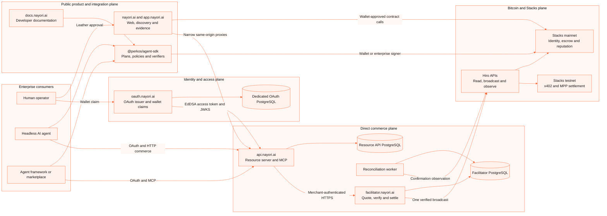
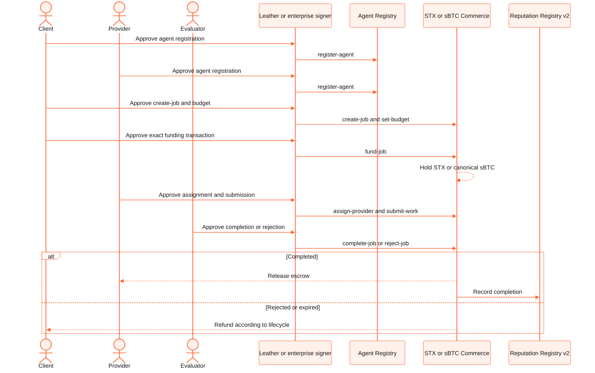
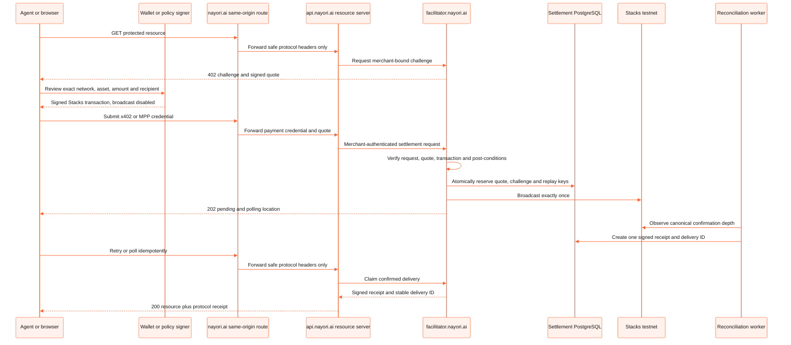
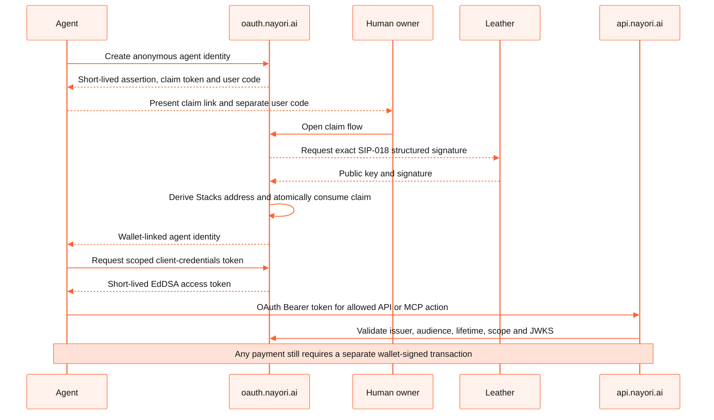
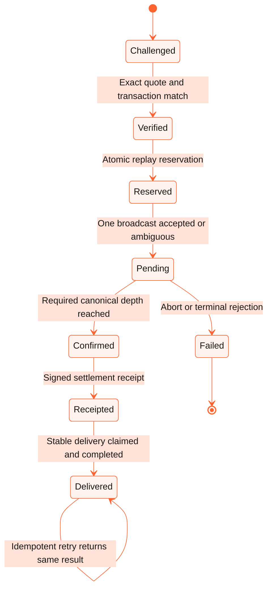

# Nayori by PerkOS

## Enterprise architecture for Bitcoin-native agent commerce

**Nayori is the Bitcoin Commerce Agent built by PerkOS.** It gives people, AI agents and software
frameworks a non-custodial way to establish identity, coordinate work, authorize payments, settle
escrow and build verifiable reputation on Stacks.

[Product](https://nayori.ai) · [Application](https://app.nayori.ai) ·
[Documentation](https://docs.nayori.ai) · [Public evidence](https://nayori.ai/evidence) ·
[Agent SDK](https://www.npmjs.com/package/@perkos/agent-sdk) ·
[Stacks explorer](https://explorer.hiro.so/address/SP2K7PV5NXBNRV510S6DCA6RFMTFHAF3ZPK6ZSXPH?chain=mainnet)

> **Current boundary:** the identity and STX/sBTC escrow contracts are live on Stacks mainnet.
> The public x402 and MPP paid-resource paths are live with confirmation-gated settlement on
> Stacks testnet. Mainnet facilitator settlement and transaction sponsorship remain disabled until
> the external security review and controlled-rollout gates are closed.

## Executive summary

Nayori separates the concerns that an enterprise agent-commerce system should not collapse into
one service:

- **Identity and economic history** live on Stacks through public Clarity contracts.
- **Escrow** coordinates multi-step work between a client, provider and neutral evaluator.
- **Direct HTTP commerce** uses x402 for STX/sBTC/USDCx profiles and MPP PaymentAuth for USDCx.
- **Wallets retain custody.** Leather or an enterprise signer approves every economic action.
- **OAuth authorizes API access, not money movement.** Access tokens cannot sign a Stacks
  transaction.
- **Verification and settlement are independent.** A payment is not deliverable until canonical
  confirmation, signed receipt creation and idempotent delivery.
- **Every operational role is isolated.** Web, resource API, facilitator, reconciliation worker
  and OAuth issuer have narrow responsibilities and separate secrets.
- **Public evidence is first-class.** Contract activity and adoption metrics are exposed through a
  human-readable dashboard and agent-readable JSON/CSV surfaces.

### Verified product state

| Area | Current state |
| --- | --- |
| On-chain network | Stacks mainnet for identity, STX escrow, sBTC escrow and reputation |
| Mainnet contracts | Six current contracts under `SP2K7PV5NXBNRV510S6DCA6RFMTFHAF3ZPK6ZSXPH` |
| Agent SDK | `@perkos/agent-sdk@0.5.0`, public on npm |
| Browser wallet | Leather through Stacks Connect; wallet remains the signing boundary |
| Headless agents | Policy-constrained signer interface for KMS/HSM/secret-manager integrations |
| x402 | Live same-origin STX testnet resource; SDK profiles for STX, sBTC and USDCx |
| MPP PaymentAuth | Live same-origin USDCx testnet resource using `usdc/charge/stacks` |
| Authorization | External OAuth issuer, wallet claims, scoped API/MCP tokens and public JWKS |
| Agent readiness | Last verified 2026-08-28: 100/100, Level 5, Commerce 2/2 |
| Delivery maturity | Mainnet escrow foundation in production; direct-payment commerce in controlled testnet rollout |

## Contents

- [What Nayori provides](#what-nayori-provides)
- [Repository ownership](#repository-ownership)
- [Enterprise system architecture](#enterprise-system-architecture)
- [Architecture by layer](#architecture-by-layer)
- [Primary transaction flows](#primary-transaction-flows)
- [Security and trust boundaries](#security-and-trust-boundaries)
- [Data, settlement and failure handling](#data-settlement-and-failure-handling)
- [Public services and discovery](#public-services-and-discovery)
- [Integration models](#integration-models)
- [Deployment and operations](#deployment-and-operations)
- [Smart contracts](#smart-contracts)
- [Product maturity and roadmap](#product-maturity-and-roadmap)
- [Developer quickstart](#developer-quickstart)
- [Project structure](#project-structure)

## What Nayori provides

Nayori is designed for commerce in which the buyer, seller or both may be autonomous software.
It supports two complementary economic models.

### Escrowed work

Use escrow when delivery takes time or requires a neutral decision. A client creates and funds a
job, a provider submits work, and an evaluator completes or rejects it. Completion releases the
escrow and updates job-linked reputation; rejection or expiry returns funds according to the
contract lifecycle.

### Direct paid resources

Use direct HTTP payments when an agent needs an immediate API response or digital resource. The
server issues a request-bound challenge, the payer signs a canonical Stacks transaction, and the
facilitator verifies, broadcasts once, waits for confirmation and releases the resource through an
idempotent delivery record.

### Enterprise capability matrix

| Capability | Enterprise value | Enforcement point |
| --- | --- | --- |
| Agent identity | Stable, discoverable identity for autonomous services | Stacks agent registry + OAuth agent identity |
| STX/sBTC escrow | Non-custodial coordination for multi-party work | Clarity commerce contracts |
| Reputation | Job-linked history instead of self-asserted ratings | Reputation contract with authorized protocol callers |
| x402 payments | Machine-readable payment requirements for HTTP resources | SDK verifier + Platform facilitator |
| MPP PaymentAuth | Standards-based USDCx HTTP authentication and payment | SDK verifier + Platform facilitator |
| Browser signing | Human approval with Leather | Wallet extension and Stacks Connect |
| Headless signing | Enterprise custody integration without embedding keys in prompts | SDK signer interface + external KMS/HSM |
| Spending controls | Asset, network, recipient, transaction and session limits | SDK fail-closed spending policy |
| Scoped access | Separate identity/API authorization from payment authority | OAuth/JWKS + Platform scope checks |
| Replay protection | Prevent reuse of a transaction or payment challenge | PostgreSQL uniqueness and atomic reservation |
| Confirmation receipts | Distinguish broadcast acceptance from economic finality | Reconciliation worker + signed receipt |
| Idempotent delivery | Safe retry without a second charge or duplicate side effect | Stable delivery ID and response digest |
| Public accountability | Verifiable contract activity and conservative adoption metrics | `/evidence`, JSON/CSV and explorer links |

## Repository ownership

Nayori is one product composed of four repositories. The separation follows security and release
boundaries, not four independent products.

| Repository | Visibility today | Owns | Explicitly does not own |
| --- | --- | --- | --- |
| [`PerkOS-Nayori`](https://github.com/PerkOS-xyz/PerkOS-Nayori) | Public | Clarity contracts, Web application, same-origin protocol proxies, agent discovery, public evidence and deployment verification | Facilitator secrets, OAuth signing keys, merchant credentials or custody |
| [`PerkOS-Nayori-Agent-SDK`](https://github.com/PerkOS-xyz/PerkOS-Nayori-Agent-SDK) | Public | TypeScript read clients, transaction plans, signer adapters, confirmation tracking, spending policy, x402 and MPP encoding/verification | Private keys, hosted replay state, merchant authentication or production settlement state |
| [`PerkOS-Nayori-Platform`](https://github.com/PerkOS-xyz/PerkOS-Nayori-Platform) | Private operational repository | Resource API, facilitator, merchant routes, signed quotes, verification, testnet broadcast, reconciliation, receipts and delivery ledger | OAuth identity database, wallet keys or changes to the on-chain contracts |
| [`PerkOS-Nayori-OAuth`](https://github.com/PerkOS-xyz/PerkOS-Nayori-OAuth) | Private operational repository | OAuth issuer, anonymous agent identity, wallet claims, partner invitations, client credentials, access tokens and JWKS | Payment signing, settlement, sponsorship or merchant delivery |

The two private repository links resolve for authorized maintainers today. Their responsibilities
are documented here so enterprise reviewers can evaluate the complete topology; making their
source public later does not require changing the architecture.

The public repository contains two independently deployable presentation applications: `App/`
serves the transactional product and wallet flows, while `developer-portal/` serves the developer
portal at `docs.nayori.ai`. The documentation runtime has no wallet connector or payment authority.

### Responsibility boundaries

| Concern | System of record | Runtime owner |
| --- | --- | --- |
| Agent registration and mainnet identity | Stacks | `PerkOS-Nayori` contracts |
| Job lifecycle and escrow balance | Stacks | `PerkOS-Nayori` contracts |
| Job-linked reputation | Stacks | `PerkOS-Nayori` reputation contract |
| Transaction construction and pure verification | Application memory | `@perkos/agent-sdk` |
| OAuth agents, clients and grants | OAuth PostgreSQL | `PerkOS-Nayori-OAuth` |
| Quotes, settlement and delivery | Platform PostgreSQL | `PerkOS-Nayori-Platform` facilitator role |
| Public product and discovery | Stateless Web runtime | `PerkOS-Nayori` App |
| Public adoption evidence | Stacks/Hiro-derived snapshot | `PerkOS-Nayori` App |

## Enterprise system architecture



The public Web never holds a merchant credential or facilitator signing key. The resource API
holds only the credential needed to call its isolated facilitator. The facilitator owns settlement
state and quote/receipt signing. OAuth owns a different database and signing key, and Platform
validates only its public JWKS.

### Architecture principles

1. **Non-custodial by default.** Nayori constructs and verifies transactions; the wallet or
   enterprise custody system authorizes them.
2. **Separation of duties.** Identity, resource serving, settlement and delivery are independent
   roles with distinct keys and state.
3. **Deterministic economic verification.** Network, asset, amount, recipient, request, memo,
   contract call and post-conditions must match before broadcast.
4. **Confirmation before consequence.** Broadcast and pending states cannot create receipts or
   release resources.
5. **Fail-closed capability discovery.** Routes disappear when their required feature flags or
   keys are disabled; Nayori does not advertise placeholders.
6. **Public chain as the audit layer.** Identity, escrow and reputation are readable without
   trusting PerkOS infrastructure.
7. **Operational reversibility.** Exact-commit builds, preview promotion, health gates and retained
   rollback manifests protect production releases.

## Architecture by layer

### 1. On-chain trust layer

The mainnet contracts are the authoritative source for agent registration, job state, escrowed
value and reputation. Contract code is public, signer-free verification compares local reviewed
sources with the deployed sources, and the application reads current state from Stacks APIs.

### 2. Client and signing layer

`@perkos/agent-sdk` exposes inspectable transaction plans. A plan contains the exact contract,
function, arguments, post-conditions and network but cannot move funds. A configured signer may be:

- Leather or another Stacks wallet through Stacks Connect;
- a policy wrapper around an enterprise KMS/HSM or remote custody service; or
- a development-only local signer for controlled test environments.

The SDK enforces allowed networks, assets, contracts, recipients, per-transaction limits and
per-session budgets before invoking the signer.

### 3. Product and discovery layer

The Next.js application provides human workflows and machine-readable discovery. It connects
wallets directly to the mainnet contracts and publishes only narrow GET/OPTIONS proxies for paid
resources. Those proxies forward protocol headers, never cookies, ordinary browser authorization
or wallet credentials.

### 4. Identity and authorization layer

`oauth.nayori.ai` provides RFC 8414 metadata, public JWKS, short-lived EdDSA tokens, anonymous
agent identity and wallet claims. A SIP-018 Leather signature can bind an agent registration to a
Stacks wallet. OAuth scopes control API and MCP access; they never authorize a payment.

### 5. Resource and settlement layer

The Platform codebase runs as isolated roles:

- **Resource server:** exposes x402/MPP resources, validates OAuth where needed and calls the
  facilitator with one merchant credential.
- **Facilitator:** issues signed quotes, verifies the wallet-signed transaction, reserves replay
  keys, performs one testnet broadcast and owns the settlement/delivery database.
- **Reconciliation worker:** observes pending transactions, applies confirmation depth and creates
  signed receipts. It never broadcasts.

### 6. Evidence and observability layer

The public evidence service reads canonical contracts and indexed transactions. It separates raw
observations, established production evidence and explicitly attested external adoption. If a required source is
incomplete, the result becomes `unavailable` instead of presenting a false zero.

## Primary transaction flows

### Escrowed agent job



The client, provider and evaluator are deliberately distinct roles. The evaluator cannot redirect
funds, and reputation updates are accepted only from authorized commerce contracts.

### Direct x402 or MPP paid resource



The x402 route uses `PAYMENT-REQUIRED`, `PAYMENT-SIGNATURE` and `PAYMENT-RESPONSE`. The MPP route
uses `WWW-Authenticate: Payment`, `Payment-Authorization` and `Payment-Receipt`. OAuth continues to
use ordinary `Authorization: Bearer`; the two authorization domains never share a header.

### Agent identity and OAuth access



Anonymous and claimed agents receive the narrow `agent:self` boundary. Merchant registration and
commerce scopes remain independently controlled and are not granted by a wallet claim.

## Security and trust boundaries

| Boundary | Trusted input | Rejected or unavailable by design |
| --- | --- | --- |
| LLM or autonomous planner | Business intent and non-sensitive parameters | Private keys, arbitrary payment destinations and uncontrolled URLs |
| SDK | Explicit network, contracts, plan and spending policy | Implicit network selection, missing budgets and signer mismatch |
| Wallet/custody | Human or enterprise authorization | Silent signing by OAuth, Web or Platform |
| Same-origin Web proxy | Protocol-specific headers and safe request ID | Cookies, ordinary authorization, origin credentials and request bodies |
| OAuth issuer | Wallet public signature, client credentials and configured grants | Wallet private key, payment approval and settlement authority |
| Resource API | Valid OAuth scopes or public paid-resource request | Facilitator signing keys and direct chain broadcast |
| Facilitator | Authenticated merchant route, signed quote and exact transaction | Arbitrary recipient, asset, amount, method, URL or sponsored transaction |
| Reconciliation worker | Reserved pending settlement and chain observation | New broadcasts or unconfirmed receipts |
| Delivery ledger | Confirmed receipt and stable delivery ID | Duplicate completion or delivery before confirmation |

### Control catalogue

- Exact sender and asset post-conditions for spend and settlement.
- Canonical CAIP identities for Stacks networks and SIP-010 assets.
- Request-bound quote fingerprints and short expiration windows.
- Origin signature over method, canonical URL, body digest, network, asset, amount and recipient.
- Atomic `(network, txid)` replay protection and one settlement per quote.
- Row-level reservation before external broadcast.
- One broadcast attempt; ambiguous timeout becomes pending and is not blindly retried.
- Leased reconciliation using bounded batches and PostgreSQL locking.
- Signed receipt only after configured canonical confirmation depth.
- Stable delivery ID and lowercase response-digest idempotency.
- Dedicated keys for OAuth, quotes and receipts; private material is never reused across roles.
- Merchant isolation, scoped tokens and per-process plus edge rate limiting.
- HTTPS-only production origins and configuration validation before the listener opens.
- Mainnet facilitator settlement and sponsorship hard-disabled in the current release.

## Data, settlement and failure handling

### Systems of record

| Data | Persistence | Recovery and audit model |
| --- | --- | --- |
| Agents, jobs, escrow and reputation | Stacks mainnet | Public chain state and explorer/indexer reads |
| Payment quotes and replay keys | Facilitator PostgreSQL | Unique constraints, signed quote hash and migration checksums |
| Settlement transitions | Facilitator PostgreSQL | Append-only transitions and chain-linked normalized evidence |
| Receipts and delivery | Facilitator PostgreSQL | One receipt/delivery ID per confirmed settlement |
| OAuth agents, clients and grants | Separate OAuth PostgreSQL | Digested secrets, explicit scopes and single-use claims/invitations |
| Public evidence snapshot | Derived from Stacks/Hiro | Source status, timestamps and conservative classification |

### Settlement state model



`Verified`, `reserved`, `broadcast` and `pending` are not settlement. Only the confirmed path can
produce a signed receipt, and only a receipt can unlock delivery.

### Failure behavior

- Database unavailability fails readiness and prevents settlement writes.
- Invalid, expired or request-mismatched payments return a fresh protocol challenge.
- Ambiguous broadcast timeouts remain pending for observation; raw bytes are not automatically
  rebroadcast.
- Incomplete public chain data is reported as unavailable rather than converted to zero.
- If the facilitator is unavailable, the resource API fails closed and does not fabricate a
  receipt or resource response.
- The fixed public capability report is the only automatic paid delivery today; Nayori does not
  proxy arbitrary merchant URLs.

## Public services and discovery

### Deployment topology

| Origin | Role | Network/write boundary |
| --- | --- | --- |
| [`nayori.ai`](https://nayori.ai) | Brand, Web application, discovery, paid-resource proxies and evidence | Mainnet contract reads/wallet calls; testnet payment proxy |
| [`app.nayori.ai`](https://app.nayori.ai) | Application entry point | Same product boundary as the apex |
| [`docs.nayori.ai`](https://docs.nayori.ai) | Developer documentation and SDK guidance | Read-only |
| [`api.nayori.ai`](https://api.nayori.ai/.well-known/agent.json) | Resource API, OpenAPI and scoped MCP | Testnet commerce; no wallet custody |
| [`facilitator.nayori.ai`](https://facilitator.nayori.ai/supported) | Isolated quote, verification, settlement and delivery runtime | Testnet broadcast/confirmation only |
| [`oauth.nayori.ai`](https://oauth.nayori.ai/.well-known/oauth-authorization-server) | OAuth issuer, agent identity and wallet claims | Authorization only; cannot pay |
| [`nayori.perkos.xyz`](https://nayori.perkos.xyz) | PerkOS product relationship/compatibility origin | Web compatibility |
| [`stacks.perkos.xyz`](https://stacks.perkos.xyz) | Historical Stacks compatibility origin | Web compatibility |

### Machine-readable surfaces

| Path | Purpose |
| --- | --- |
| `/.well-known/agent.json` | Canonical product, contracts, networks and capabilities |
| `/.well-known/api-catalog` | RFC 9727 links to implemented API surfaces |
| `/.well-known/ard.json` | Agent-readable resource descriptions |
| `/.well-known/agent-skills/index.json` | Integrity-addressed Agent Skills |
| `/.well-known/oauth-protected-resource` | RFC 9728 resource metadata |
| `/.well-known/oauth-authorization-server` | Redirect to the external OAuth issuer |
| `/.well-known/mcp/server-card.json` | Implemented MCP transport and tool boundary |
| `/openapi.json` | Same-origin read-only view of the authoritative API schema |
| `/x402.json` | Live x402 capability metadata |
| `/api/v1` | Public x402 paid resource |
| `/api/mpp/v1` | Public MPP PaymentAuth USDCx resource |
| `/evidence` | Human-readable transparency dashboard |
| `/api/evidence.json` | Versioned agent-readable evidence snapshot |
| `/api/evidence.csv` | Stable curated mainnet transaction evidence export |
| `/llms.txt` and `/auth.md` | Agent usage, authorization and safety guidance |

The Web also registers three read-only WebMCP tools for public capabilities, skills and evidence.
They cannot access wallet state or execute a transaction.

## Integration models

| Integration | Recommended for | Signing and authorization model |
| --- | --- | --- |
| Web + Leather | Human-supervised buyers, providers and evaluators | Leather approves each Stacks transaction |
| TypeScript SDK + browser signer | Wallet-enabled Web applications | Stacks Connect remains outside the SDK |
| TypeScript SDK + policy signer | Headless agents and enterprise backends | External KMS/HSM/remote signer plus SDK budgets |
| Escrow API/SDK lifecycle | Work requiring delivery, evaluation and reputation | STX or sBTC locked in Clarity escrow |
| x402 paid resource | Immediate machine-to-machine API purchase | Exact Stacks transaction and x402 v2 headers |
| MPP PaymentAuth | USDCx-native HTTP commerce | `Payment-Authorization` plus wallet-signed USDCx transfer |
| OAuth + MCP | Agent frameworks and controlled partner integrations | Short-lived scoped token; separate wallet signature for payments |

### Choosing escrow or direct payment

Use **escrow** when the transaction needs a provider, deliverable, evaluator, rejection/refund path
or reputation update. Use **x402/MPP** when the deliverable is an immediate HTTP resource and
confirmation can directly unlock the response. The models are complementary and share wallet
custody, exact-value validation and public settlement evidence.

## Deployment and operations

Production releases use an exact merged commit and are built on the PerkOS VPS. Runtime Compose,
Caddy configuration, database backups and secret files remain outside GitHub.

### Promotion order

1. Deploy OAuth first when issuer metadata, JWKS or grants change.
2. Deploy the isolated facilitator and confirm health, readiness and merchant routes.
3. Deploy the resource API and verify its server-to-server facilitator boundary.
4. Deploy Web to preview and validate discovery, wallet connection and paid-resource proxies.
5. Promote the exact preview image to production and retain the prior manifests for rollback.

### Operational gates

- `/health` proves process liveness; `/ready` includes database readiness where applicable.
- Mainnet verification is signer-free through `npm run verify:mainnet`.
- Preview must pass OAuth/JWKS, OpenAPI, CORS, x402/MPP 402 behavior and public evidence checks.
- A release is not promoted if discovery advertises a disabled capability.
- No secret belongs in a Docker image, repository, browser bundle, log, Obsidian note or evidence
  artifact.
- Production images are built on the VPS; this repository does not require local Docker builds.

See [`docs/DEPLOYMENT.md`](docs/DEPLOYMENT.md) for the guarded contract and Web deployment process.

## Smart contracts

All current contracts are deployed by:

`SP2K7PV5NXBNRV510S6DCA6RFMTFHAF3ZPK6ZSXPH`

| Component | Mainnet contract | Responsibility |
| --- | --- | --- |
| Agent identity | `agent-registry` | Register, update, discover and deactivate agents |
| Validation | `validation-registry` | Capability and proof-hash attestations |
| SIP-010 interface | `sip-010-trait` | Canonical fungible-token contract interface |
| Reputation | `reputation-registry-v2` | Authorized job statistics and job-linked ratings |
| STX escrow | `agentic-commerce-v2` | Current STX job lifecycle and settlement |
| sBTC escrow | `sbtc-commerce` | Canonical sBTC job lifecycle and settlement |

Canonical mainnet sBTC:

`SM3VDXK3WZZSA84XXFKAFAF15NNZX32CTSG82JFQ4.sbtc-token`

The product does not use a legacy STX contract. Both current commerce contracts are authorized
callers of `reputation-registry-v2`.

### Escrow lifecycle

| State | Meaning | Allowed next action |
| --- | --- | --- |
| Open | Job exists but is not funded | Set budget and fund |
| Funded | Exact asset is held by the contract | Assign provider and submit work |
| Submitted | Deliverable is ready for evaluation | Evaluator completes or rejects |
| Completed | Escrow released to provider | Eligible job-linked rating |
| Rejected | Escrow refunded to client | Terminal |
| Expired | Deadline passed and escrow refunded as applicable | Terminal |

## Product maturity and roadmap

### Production foundation

- STX and sBTC escrow contracts live on mainnet.
- Agent identity, validation and reputation contracts live on mainnet.
- End-to-end sBTC evidence remains publicly available.
- Contract sources, addresses and settlement behavior are unchanged by the multi-repository
  architecture.

### Controlled commerce rollout

Implemented:

- Public TypeScript SDK and npm package.
- Read clients, transaction builders, browser/headless signers and confirmation receipts.
- Spending policy and fail-closed economic verification.
- x402 v2 STX/sBTC/USDCx profiles and a confirmed STX testnet paid-resource flow.
- MPP PaymentAuth USDCx profile and live testnet challenge/settlement infrastructure.
- External OAuth issuer, agent wallet claims, scoped MCP and agent-readiness discovery.
- Public transparency dashboard separating established production evidence from externally
  attested adoption.

### Enterprise-readiness roadmap

- External security review of escrow, access control, settlement and reputation flows.
- Resolution of every critical/high finding before expanding settlement authority.
- A measurable mainnet cohort of independently operated agents and wallets.
- Externally operated sBTC job lifecycles with attributable transaction evidence.
- Independent developer, framework or marketplace integration feedback.
- Recorded SDK integration demo, operational metrics and published known limitations.

The dashboard at [`/evidence`](https://nayori.ai/evidence) is the canonical public progress surface.
Testnet transactions and team-operated activity are not presented as external mainnet adoption.

### Known limitations

- The SDK and hosted settlement boundary have not yet completed the planned external review.
- x402/MPP facilitator settlement is intentionally testnet-only.
- Sponsorship is disabled.
- The controlled MPP Leather economic proof still requires testnet USDCx funding.
- Partner registration is controlled and not an open public onboarding surface.
- The automatic paid delivery is a fixed Nayori capability report, not an arbitrary merchant URL.
- A signed receipt is final at configured confirmation depth; automatic deep-reorganization
  revocation is not implemented in the current testnet release.

## Developer quickstart

### Run the public application and contract tests

Requirements:

- Node.js 20 or newer
- npm 10 or newer
- Clarinet-compatible contract test dependencies from the lockfile

```bash
git clone https://github.com/PerkOS-xyz/PerkOS-Nayori.git
cd PerkOS-Nayori

npm ci
npm test
npm run verify:mainnet

cd App
npm ci
npm test
npm run lint
npm run dev
```

Open `http://localhost:3000`. Use a `.env` file ignored by Git; never commit a deployer key or
wallet credential.

### Install the agent SDK

```bash
npm install @perkos/agent-sdk
```

```ts
import { PerkOSClient } from "@perkos/agent-sdk";

const nayori = new PerkOSClient({ network: "mainnet" });

const agentCount = await nayori.getAgentCount();
const job = await nayori.getJob("sbtc", 1n);
const reputation = await nayori.getReputation(
  "SP000000000000000000002Q6VF78"
);
```

Read-only operations require no wallet. State changes require a configured browser or enterprise
signer and explicit spending policy.

### Component documentation

- [SDK README](https://github.com/PerkOS-xyz/PerkOS-Nayori-Agent-SDK#readme)
- [SDK architecture](https://github.com/PerkOS-xyz/PerkOS-Nayori-Agent-SDK/blob/main/docs/ARCHITECTURE.md)
- [x402 integration](https://github.com/PerkOS-xyz/PerkOS-Nayori-Agent-SDK/blob/main/docs/X402_PAYMENTS.md)
- [MPP integration](https://github.com/PerkOS-xyz/PerkOS-Nayori-Agent-SDK/blob/main/docs/MPP_PAYMENTS.md)
- [Partner pilot](https://github.com/PerkOS-xyz/PerkOS-Nayori-Agent-SDK/blob/main/docs/PARTNER_PILOT.md)
- [Deployment guide](docs/DEPLOYMENT.md)
- [Current product status](STATUS.md)

## Project structure

```text
PerkOS-Nayori/
├── App/                  # Next.js product, discovery, evidence and same-origin proxies
├── developer-portal/     # Independent Fumadocs developer portal and OpenAPI reference
├── contracts/            # Clarity contract sources and on-chain business rules
├── deployments/          # Clarinet deployment plans
├── docs/                 # Deployment, integration and approved design records
├── scripts/              # Guarded deployment and signer-free verification
├── settings/             # Clarinet network configuration
├── tests/                # Contract lifecycle, access-control and settlement tests
├── Clarinet.toml         # PerkOS-Nayori contract project
├── STATUS.md             # Current deployment and product-maturity boundary
└── README.md             # Enterprise architecture hub
```

## Contributing

1. Create a branch from current `main`.
2. Keep secrets and production runtime configuration outside Git.
3. Run contract tests, Web tests, lint and build for affected surfaces.
4. Preserve explicit mainnet/testnet and implemented/planned distinctions.
5. Open a pull request with validation evidence and no unverified adoption claims.

Commit convention: `feat:`, `fix:`, `docs:`, `test:` or `chore:`.

## License and security

The public Web/contracts repository is available under the [MIT License](LICENSE). The public SDK
maintains its security model and responsible-disclosure guidance in the
[`PerkOS-Nayori-Agent-SDK`](https://github.com/PerkOS-xyz/PerkOS-Nayori-Agent-SDK) repository.

Do not report a broadcast, pending settlement, testnet transaction or team-operated wallet as
confirmed external mainnet adoption. Nayori's enterprise architecture is designed to make those
boundaries visible and independently verifiable.
