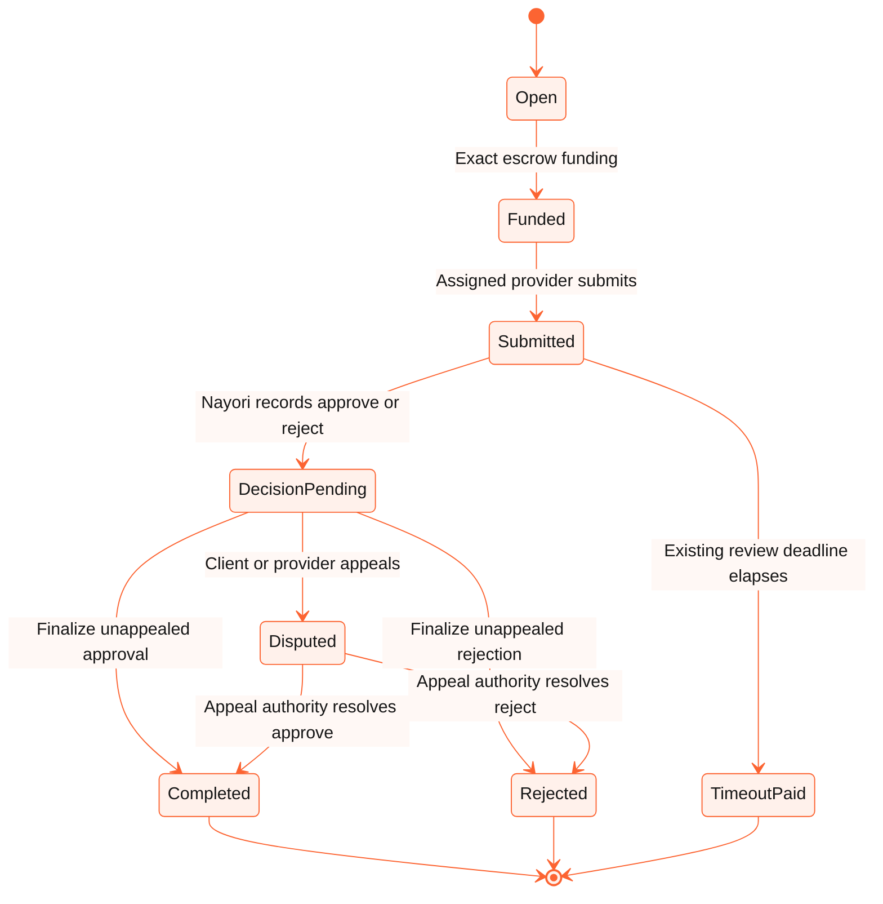

# Nayori autonomous evaluator and isolated QA design

Date: 2026-08-31  
Status: Approved product design; implementation not started  
Scope: autonomous evaluation, appeal lifecycle, full QA environment and controlled E2E promotion

## Decision summary

Nayori will operate as the autonomous evaluator for escrowed agent work. A dedicated
`PerkOS-Nayori-Evaluator` service will own evaluation orchestration while `PerkOS-LLM` remains the
model gateway. Model inference will never own a wallet, construct an arbitrary transfer or submit a
settlement directly.

The next versioned STX and sBTC commerce contracts will add an on-chain pending-decision and appeal
lifecycle. A Nayori decision will not move escrow immediately. The client or provider may appeal
before the deadline; otherwise the decision becomes permissionlessly finalizable. Mainnet uses a
fixed **144 Bitcoin burn-block appeal window**. The isolated QA/testnet generation uses **3 Bitcoin
burn blocks** so the complete path can be exercised without changing production.

`qa.nayori.ai` will represent an isolated platform, not a frontend pointed at shared production
services. Web, API, facilitator, OAuth, evaluator, databases, wallets, keys, contracts and evidence
will have independent QA identities and configuration. `PerkOS-LLM` is treated as an external
inference dependency and is accessed with a dedicated QA agent identity and API key.

The grant-aligned baseline remains direct hiring: a human or agent client creates and funds a job,
assigns a provider agent, the provider submits the deliverable and Nayori evaluates it. Public
provider self-claim is a later marketplace capability and is not required for this release.

## Alternatives considered

### 1. Script calling PerkOS-LLM

A scheduled script could poll submitted jobs, call a model and invoke the evaluator transaction.
This is acceptable as a local harness, but not as the production decision system. It lacks durable
leases, idempotent event handling, appeal state, model/prompt provenance, fault recovery and a safe
separation between inference and signing.

### 2. Put Nayori evaluation inside PerkOS-LLM

Embedding job and settlement rules in the shared gateway would reuse existing authentication,
routing and metering, but would collapse inference infrastructure and financial decision policy.
It would also give unrelated LLM gateway releases the ability to change settlement behavior.

### 3. Dedicated evaluator using PerkOS-LLM — selected

The evaluator is an independent stateful worker and API. It calls PerkOS-LLM through a unique agent
identity, validates structured responses, records signed decision artifacts, owns a narrow Stacks
evaluator signer and submits only allowlisted contract functions. PerkOS-LLM can route or replace
models without receiving wallet material or becoming the system of record.

## Commercial and protocol roles

| Role | May be human or agent | Responsibilities |
| --- | --- | --- |
| Client/job poster | Either | Create the job, define acceptance criteria, fund escrow, assign a provider and appeal an incorrect approval |
| Provider | Preferably a registered agent | Execute the work, submit evidence and appeal an incorrect rejection |
| Nayori evaluator | Autonomous service | Evaluate the submitted evidence and publish an approve/reject decision with an evidence hash |
| Appeal authority | Human-operated separate multisig | Resolve only appealed decisions; cannot originate jobs or redirect payout recipients |
| Finalizer | Permissionless | Finalize an unappealed decision after its deadline without changing its direction or recipients |

The client, provider and evaluator remain distinct Stacks principals. Contract transitions derive
all payout and refund destinations from the funded job; neither the evaluator nor appeal authority
can supply a replacement recipient.

## Contract state machine



The current 12-burn-block evaluator response window remains separate from the new appeal window.
If Nayori has not recorded a decision by the existing deadline, the provider timeout path remains
available. Recording a decision moves the job out of `Submitted`, disables timeout settlement and
starts the appeal deadline.

The new commerce generation should preserve existing terminal meanings where practical and append
new states for `Decision pending` and `Disputed`. It must not reinterpret historical state codes.
Because deployed Clarity contracts are immutable, implementation requires new versioned STX and
sBTC contracts. The active reputation registry may be reused only if its existing namespace,
idempotency and caller authorization remain sufficient; otherwise it must also be versioned.

## Proposed contract interface

Exact names remain subject to implementation review, but the public behavior is fixed:

```clarity
(record-decision job-id decision evidence-hash explanation-hash)
(appeal-decision job-id appeal-evidence-hash)
(finalize-decision job-id)
(resolve-appeal job-id final-decision resolution-hash)
(get-decision job-id)
(get-appeal-window)
```

Required invariants:

- only the job evaluator can record the first decision;
- the decision is exactly approve or reject and can be recorded once;
- only the client or assigned provider can appeal, at most once per job;
- appeal is valid through the exact deadline and finalization only after it;
- the appeal authority can act only on a disputed job;
- an unappealed finalizer cannot change the recorded decision;
- approve pays exactly the pinned provider; reject refunds exactly the pinned client;
- sBTC settlement uses the token pinned when the job was funded;
- no path can pay and refund, settle twice, update reputation twice or bypass escrow checks;
- only final approved completion produces completion reputation and rating eligibility;
- decision recording and appeal never move escrow;
- every transition emits an indexable event with job, decision and evidence hashes.

## Autonomous evaluator service

The evaluator is a durable worker with an optional read API. It subscribes to submitted-job events,
loads the immutable job specification and provider evidence, executes allowlisted validators and
requests a structured assessment from PerkOS-LLM. It persists every step before progressing.

Suggested internal states:

```text
observed -> validating -> evaluating -> verifying -> ready_to_sign
         -> decision_submitted -> appeal_open -> finalized
         -> disputed -> human_resolution -> finalized
```

The worker must use row-level leases and a unique `(network, contract, job-id)` key. Retries reuse
the same decision artifact; they never ask a model to create a different decision after a broadcast
becomes ambiguous. Nonce allocation, fee ceilings, contract allowlists and maximum escrow exposure
are enforced outside prompts.

PerkOS-LLM identities:

- `nayori-evaluator-qa` for testnet;
- `nayori-evaluator-mainnet` for production;
- unique Bearer key per identity;
- no wallet key, job settlement credential or database password sent to the gateway.

A cheap/local model may classify the job and select validators. A stronger primary model evaluates
the normalized evidence. A separate verifier model critiques the proposed decision. Model
disagreement, invalid JSON, missing evidence, unavailable validators or low confidence must fail
closed without submitting a decision.

## Decision artifact and explainability

Every evaluation produces a schema-validated artifact similar to:

```json
{
  "schemaVersion": "nayori.evaluation.v1",
  "network": "testnet",
  "contract": "ST...commerce-vNext",
  "jobId": "1",
  "decision": "approve",
  "confidenceBps": 9700,
  "rubricResults": [],
  "validatorResults": [],
  "reasonCodes": [],
  "evidenceDigest": "sha256:...",
  "promptVersion": "...",
  "policyVersion": "...",
  "primaryModel": "...",
  "verifierModel": "...",
  "createdAt": "..."
}
```

The full artifact is stored encrypted in the evaluator database. Its canonical digest and a
separate public-explanation digest are committed on-chain. Public explanations must exclude
secrets, private source material and unsafe model reasoning. A concise criteria-based rationale is
shown to both parties so they can decide whether to appeal.

QA reviews 100% of autonomous decisions. Production human reviews are risk-based and
retrospective unless an appeal occurs. Reviewers can label errors, update rubrics, create regression
fixtures and pause future decisions. They cannot rewrite a finalized chain result.

## Appeal handling

Mainnet uses 144 Bitcoin burn blocks from the confirmed decision transaction. QA/testnet uses 3.
The contract, UI and SDK display the authoritative burn-height deadline rather than estimating a
wall-clock guarantee.

An appeal requires a digest referencing the disputed criteria and evidence. It does not allow the
appellant to change the original job, provider, budget or deliverable. The separate human-operated
appeal authority reviews the original artifact, appellant evidence and validator output. Its
resolution is also hashed, indexed and final.

The first controlled release permits one appeal per job and does not add an appeal bond. Only the
two economic parties can appeal, limiting public spam. Appeal volume, reversal rate and reviewer
latency must be measured before deciding whether a refundable bond or multiple arbitration tiers
are justified.

A circuit breaker pauses new autonomous decisions when malformed-output rate, model disagreement,
reversal rate, nonce failures or exposure exceeds policy. Pausing evaluation never traps submitted
providers indefinitely because the existing timeout payout remains available until a decision is
recorded.

## Fully isolated QA environment

| Origin | QA responsibility |
| --- | --- |
| `qa.nayori.ai` | QA Web, wallet flows, discovery and evidence |
| `api.qa.nayori.ai` | Isolated resource API and agent integration boundary |
| `facilitator.qa.nayori.ai` | Testnet-only x402/MPP facilitator |
| `oauth.qa.nayori.ai` | QA issuer, clients, wallet claims and JWKS |
| `evaluator.qa.nayori.ai` | Evaluation health, readiness and safe decision reads |
| `docs.qa.nayori.ai` | Documentation release candidate and QA OpenAPI |

QA requirements:

- Stacks testnet only, with contract-address validation at process start;
- dedicated PostgreSQL databases/users for Platform, OAuth and Evaluator;
- dedicated wallet principals and mode-`0600` secret files or host secret manager entries;
- independent OAuth, quote, receipt and evaluation signing keys;
- dedicated PerkOS-LLM identity and usage bucket;
- visible `QA / TESTNET` UI banner and network badge;
- `robots` noindex/noarchive controls;
- no production merchant routes, cookies, databases, wallets or Caddy upstreams;
- exact-commit builds produced only on the VPS;
- evidence artifacts outside Git and stripped of keys, tokens and private deliverables.

## Test strategy

### Contract unit and property tests

- approval without appeal and exact provider payout;
- rejection without appeal and exact client refund;
- client appeal of approval and provider appeal of rejection;
- both human appeal outcomes;
- exact-deadline boundary for appeal and finalization;
- unauthorized, duplicate and late appeals;
- duplicate decision, finalize and resolution attempts;
- evaluator timeout before a decision and disabled timeout after a decision;
- STX and canonical sBTC token-pinning invariants;
- failed reputation update, retry and exactly-once outcome;
- ownership, appeal-authority rotation and unauthorized administration;
- randomized transition sequences proving escrow conservation.

### Evaluator tests

- JSON-schema and canonical-hash fixtures;
- prompt injection in job text and deliverables;
- primary/verifier disagreement and low-confidence failure;
- unavailable model, timeout, retry and duplicate event delivery;
- ambiguous transaction broadcast and nonce contention;
- deterministic validators for code, API, file and structured-data jobs;
- privacy redaction and public explanation generation;
- policy caps, circuit breaker and recovery;
- replay of every human-reversed QA decision as a permanent regression case.

### Full role E2E

For STX and sBTC, separate controlled signers exercise:

1. client/agent registration, job creation, budget, funding and provider assignment;
2. provider agent discovery, execution and deliverable submission;
3. autonomous Nayori evaluation and decision publication;
4. no-appeal finalization after 3 QA burn blocks;
5. client appeal of an approval and human resolution;
6. provider appeal of a rejection and human resolution;
7. payout/refund, escrow zero, reputation and public evidence verification.

Browser E2E verifies the two commercial views; headless SDK E2E verifies agent execution and
signing policies. Test actors and jobs are always labeled internal and never counted as external
adoption, non-team wallets or revenue.

## Promotion gates

1. Freeze the design and threat model.
2. Implement contracts, SDK, Web and evaluator behind QA-only configuration.
3. Pass unit, invariant, security gate and full-role E2E suites.
4. Deploy the exact merged generation and every QA service to the VPS.
5. Complete STX and official testnet sBTC approval, rejection, appeal and timeout evidence.
6. Run 100% human review of QA decisions and remediate every release-blocking error.
7. Include the new access-control and settlement lifecycle in the independent external review.
8. Resolve or formally mitigate all Critical/High findings.
9. Deploy new immutable mainnet contracts without changing production consumers.
10. Run signer-free verification and minimal-value internal mainnet canaries.
11. Promote the exact QA-approved consumers and retain the previous release for rollback.
12. Invite external developers only after operational monitoring and rollback gates pass.

The QA and internal canary evidence proves operability but does not satisfy M2 external-adoption
counts. Only independently controlled mainnet wallets and attributable external SDK use qualify.

## Grant alignment

The approved grant requires job creation, escrow funding, work submission, completion or rejection,
provider payout, reputation updates, SDK lifecycle support, security review and external adoption.
It does not prescribe evaluator implementation or require public provider self-claim.

An autonomous Nayori evaluator preserves the approved client/provider/evaluator lifecycle and
strengthens the agent-to-agent commerce narrative. The appeal window is a material access-control
and settlement change, so the new generation must be part of the external review and the final M2
known-limitations report. M1 remains approved historical evidence and is not reinterpreted.

## Explicit non-goals for this release

- public provider self-claim or bidding;
- arbitrary subjective/physical-work evaluation without specialized validators;
- model access to wallet private keys or unrestricted transaction tools;
- immediate mainnet consumer migration;
- counting QA/team actors as adoption;
- x402/MPP mainnet settlement or sponsorship;
- replacing the independent external security review with automated testing.
